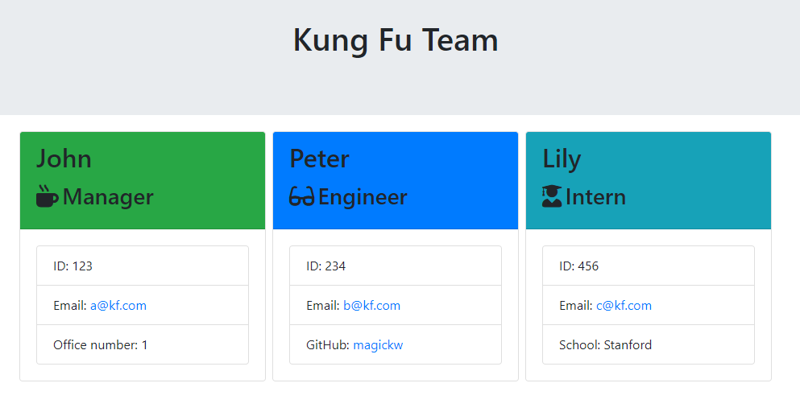
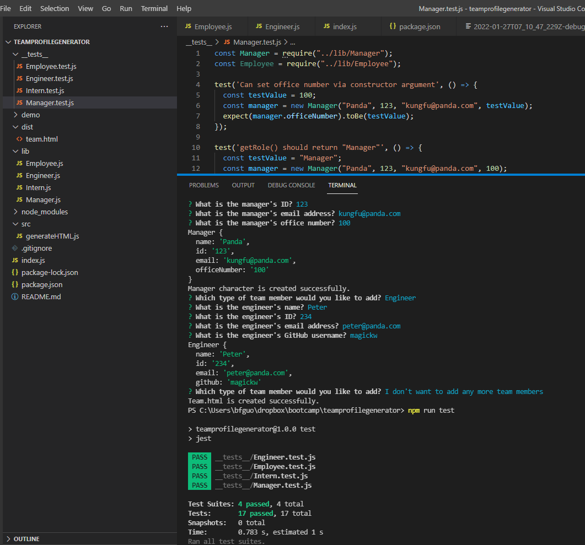

  <h1 align="center">Team Profile Generator</h1>
  

## Description
This is a command-line application that runs with Node.js to create a simple webpage featuring your development team's roster.

## Table of Contents
- [Description](#description)
- [Table of Contents](#table-of-contents)
- [Installation](#installation)
- [Usage](#usage)
- [Demo](#demo)
- [Built With](#built-with)
- [License](#license)
- [Contributing](#contributing)
- [Tests](#tests)
- [Questions](#questions)

## Installation
`git clone` the repo to your local machine. To use this application, please run the following commands:

`npm install inquirer`

`npm install jest`

## Usage
The application uses the `inquirer` package to prompt you in the command line with a series of questions about your team member. It takes your answers. Once all prompts are answered, `fs.writeFile` method will be used to generate a team roster page in the `./dist` folder.

## Demo
Please click <a href="https://watch.screencastify.com/v/jgiuyhTxTolE8xgtpxgU">here</a> for video in higher definitions.

Screenshot of output html:

Screenshot of test results:

**[⬆ back to top](#table-of-contents)**

## Built With

* [HTML](https://developer.mozilla.org/en-US/docs/Web/HTML)
* [CSS](https://developer.mozilla.org/en-US/docs/Web/CSS)
* [Javascript](https://developer.mozilla.org/en-US/docs/Web/Javascript)
  
**[⬆ back to top](#table-of-contents)**

## License
This application is licensed under MIT license. 

**[⬆ back to top](#table-of-contents)**

## Contributing
This application is developed by Baofeng Guo. If you would like to contribute it, please follow the guidelines for how to do so.

**[⬆ back to top](#table-of-contents)**

## Tests
To run tests on the application, run

`npm install jest`

and then `npm run test` from the command line.

**[⬆ back to top](#table-of-contents)**

## Questions
For any question, please contact me on GitHub: [magickw](https://github.com/magickw) or email me at peterguo1983@gmail.com.

**[⬆ back to top](#table-of-contents)**

