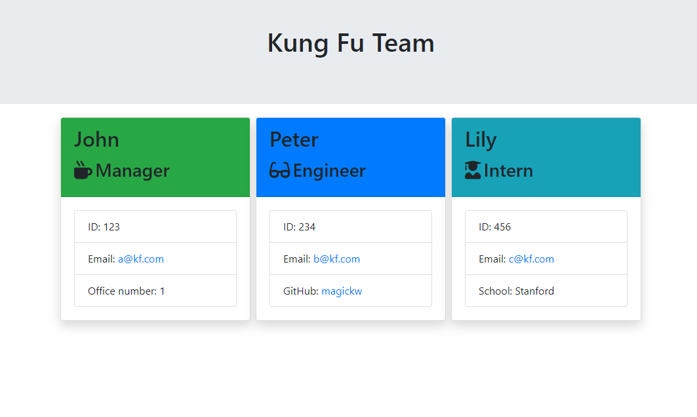

  <h1 align="center">Team Profile Generator</h1>
  

## Description
This is a command-line application that runs with Node.js.

## Table of Contents
- [Description](#description)
- [Table of Contents](#table-of-contents)
- [Installation](#installation)
- [Usage](#usage)
- [Demo](#demo)
- [License](#license)
- [Contributing](#contributing)
- [Tests](#tests)
- [Questions](#questions)

## Installation

## Usage

## Demo

**[⬆ back to top](#table-of-contents)**

## License
This application is licensed under MIT license. 

**[⬆ back to top](#table-of-contents)**

## Contributing
This application is developed by Baofeng Guo. If you would like to contribute it, please follow the guidelines for how to do so.

**[⬆ back to top](#table-of-contents)**

## Tests
No testing required beyond the test-run of the application. The repo comes with every module you need.

**[⬆ back to top](#table-of-contents)**

## Questions
For any question, please contact me on GitHub: [magickw](https://github.com/magickw) or email me at peterguo1983@gmail.com.

**[⬆ back to top](#table-of-contents)**

